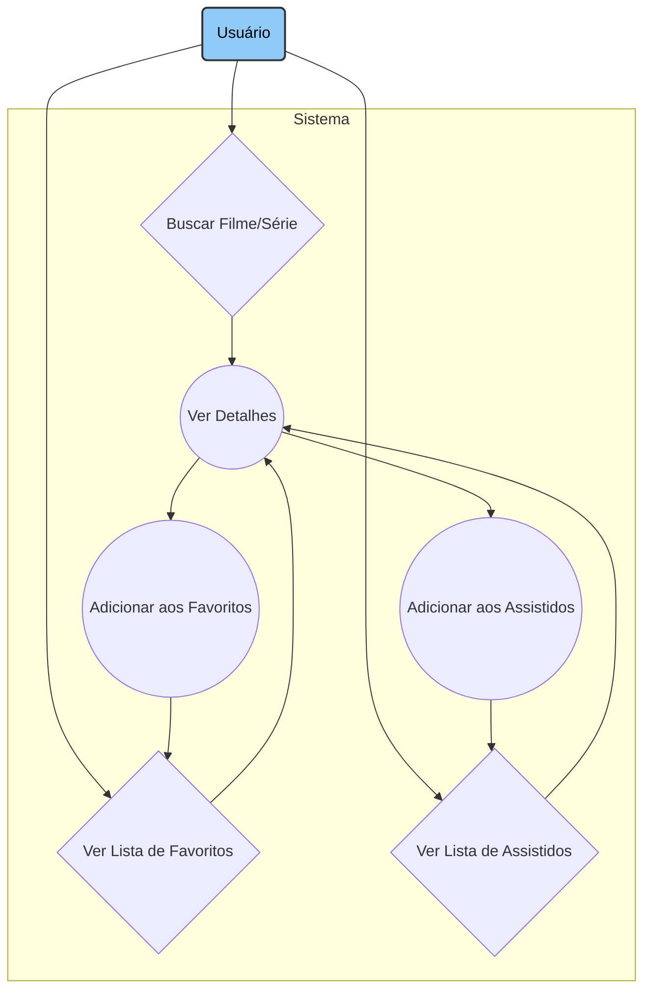

# 🎬 CineTrack: Ligado nos Filmes

CineTrack é um aplicativo iOS nativo que permite aos usuários buscar, salvar e organizar seus filmes e séries favoritos de forma simples e intuitiva. Nunca mais se esqueça daquele filme que te recomendaram ou perca a conta do que você já assistiu!

## ✨ Funcionalidades Principais
O CineTrack foi projetado para ser seu companheiro ideal no mundo do cinema e das séries. Com ele, você pode:

* 🔍 Buscar Detalhadamente: Encontre qualquer filme ou série pelo nome com uma busca rápida e eficiente.

* ℹ️ Ver Todas as Informações: Acesse uma tela de detalhes completa com pôster, sinopse, ano de lançamento e mais.

* ❤️ Criar sua Lista de Favoritos: Salve os filmes e séries que você mais ama para acessá-los facilmente.

* ✅ Marcar como Assistido: Mantenha um registro de tudo que você já assistiu.

* 📱 Navegação Intuitiva: Alterne facilmente entre a busca, seus favoritos e sua lista de assistidos através de uma Tab Bar limpa e funcional.

## 🏛️ Arquitetura e Casos de Uso
O projeto foi estruturado com base nos seguintes casos de uso, focando na experiência do usuário:

## 🛠️ Tecnologias Utilizadas
Este é um projeto 100% nativo, desenvolvido com as tecnologias mais consolidadas do ecossistema Apple:

* Linguagem: Swift

* Framework de UI:  UIKit

* Gerenciamento de Dependências:  CocoaPods

* API: The Movie Database - TMDB API

## 🚀 Como Executar o Projeto
Para rodar o CineTrack em seu ambiente local, siga os passos abaixo:

### 1. Clone o repositório
git clone https://github.com/seu-usuario/CineTrack.git

### 2. Navegue até o diretório do projeto
cd CineTrack

### 3. Abra o arquivo .xcodeproj no Xcode
open CineTrack.xcodeproj

Após abrir no Xcode, basta selecionar um simulador de iPhone e clicar em "Run" (▶️).

