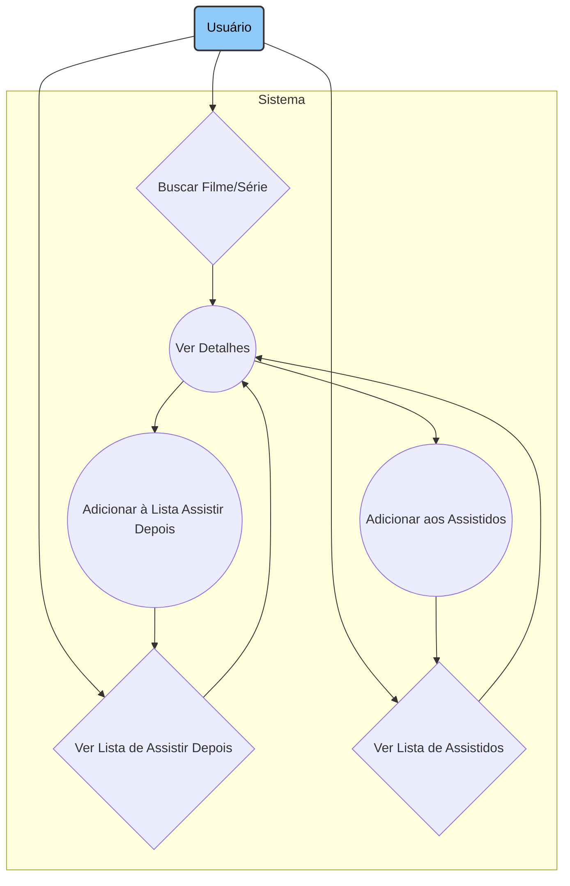

# 🎬 CineTrack: Ligado nos Filmes

CineTrack é um aplicativo iOS nativo que permite aos usuários buscar, salvar e organizar seus filmes favoritos de forma simples e intuitiva. Nunca mais se esqueça daquele filme que te recomendaram ou perca a conta do que você já assistiu!

## ✨ Funcionalidades Principais
O CineTrack foi projetado para ser seu companheiro ideal no mundo do cinema. Com ele, você pode:

* 🔍 Buscar Detalhadamente: Encontre qualquer filme pelo nome com uma busca rápida e eficiente.

* ℹ️ Ver Todas as Informações: Acesse uma tela de detalhes completa com pôster, sinopse, ano de lançamento e mais.

* ❤️ Crie sua Lista para Assistir Depois: Salve os filmes que você gostaria de assistir depois, para nunca mais se esquecer daquele filme legal!

* ✅ Marcar como Assistido: Mantenha um registro de tudo que você já assistiu.

* 📱 Navegação Intuitiva: Alterne facilmente entre a busca, sua lista de assistidos e assistir depois através de uma Tab Bar limpa e funcional.

## 🏛️ Arquitetura e Casos de Uso
O projeto foi estruturado com base nos seguintes casos de uso, focando na experiência do usuário:

## 🛠️ Tecnologias Utilizadas
Este é um projeto 100% nativo, desenvolvido com as tecnologias mais consolidadas do ecossistema Apple:

* Linguagem: Swift

* Framework de UI:  SwiftUI

* Gerenciamento de Dependências:  Swift Package Manager

* API: The Movie Database - TMDB API

## 🚀 Como Executar o Projeto
Para rodar o CineTrack em seu ambiente local, siga os passos abaixo:

### 1. Clone o repositório
git clone https://github.com/lauramarson/ads-grupo15-cinetrack.git

### 2. Navegue até o diretório do projeto
cd ads-grupo15-cinetrack/cine-track

### 3. Abra o arquivo .xcodeproj no Xcode
open cine-track.xcodeproj

### 4. Adicione um Token do TMDB
1. Abra o arquivo onde o token deve ficar armazenado com o comando: 
open cine-track/Common/Constants.swift
2. Na linha 14, adicione seu token obtido no site do TMDB.

Após abrir no Xcode, basta selecionar um simulador de iPhone e clicar em "Run" (▶️).

